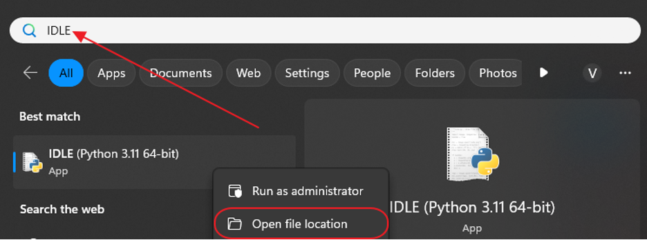
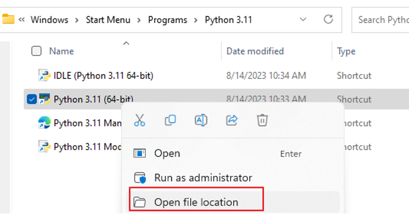
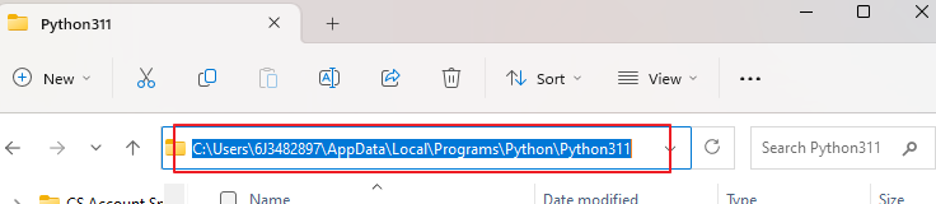
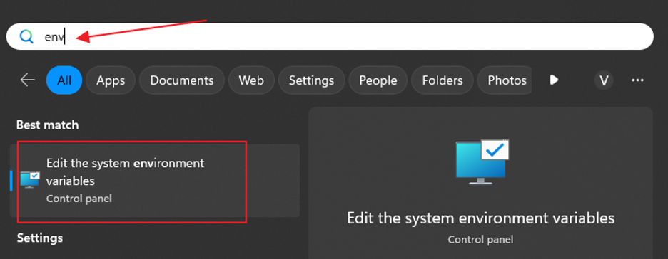
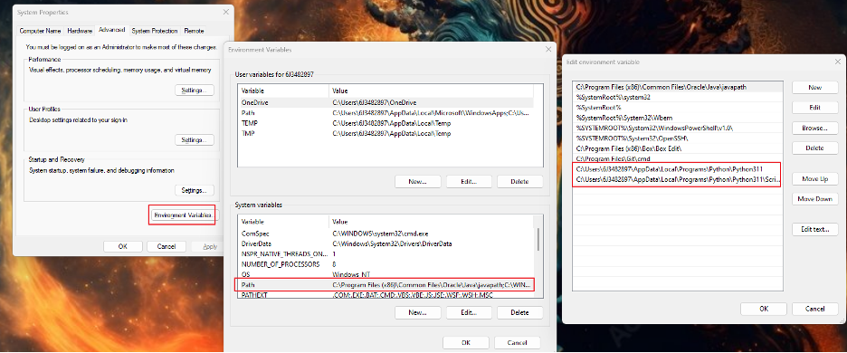
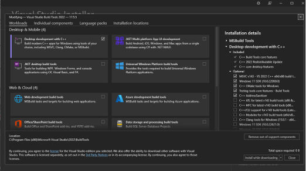
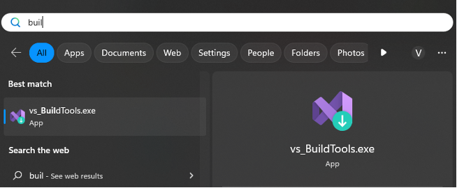
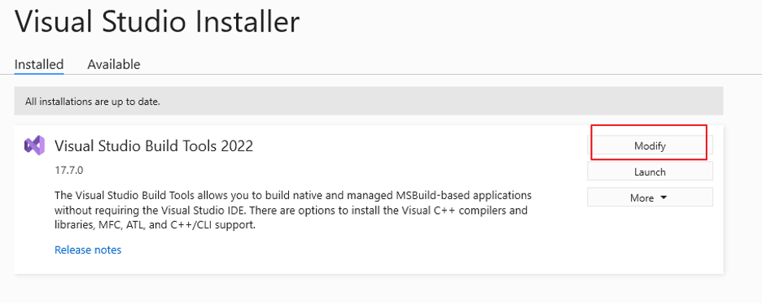
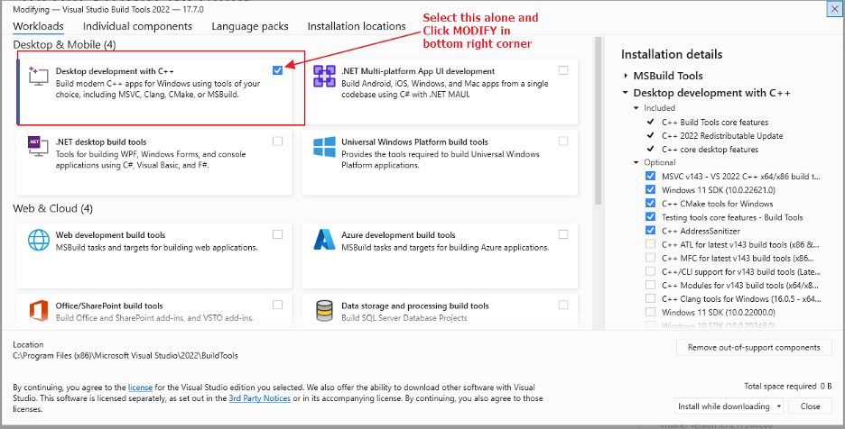
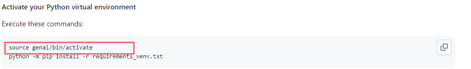

**Creating your virtual Environment in Windows**

### Before creating your virtual env, complete these steps: 

1. Find your Python folder path
Search "IDLE" in the Windows search bar
<br><br>
Click "Open file location" on python 3.11 (or your python version)
<br><br>
Copy the file location
<br><br>
2. Make sure Python is added to path
Type "env" in the Windows search bar and click "Edit the system environment variables"
<br><br>
Now click "Environment variables" >> "Path" and click "New" if Python311 does not exist already. If you click "New", simply paste the file location you copied earlier.
<br><br>
3. Install Microsoft C++ Build Tools

* Go to [this page](https://visualstudio.microsoft.com/visual-cpp-build-tools/)
* Click "Download Build Tools" and run the downloaded file
* Click "Install" (a window with different options to click should show up)
* Only select "Desktop Development with C++" >> "Install"
<br><br>
* Reboot your system
* If you have already installed Microsoft C++ Build Tools before, it needs to be modified
* Search "build tools" in the Windows search bar
<br><br>
* Click "modify" on "Visual Studio Build Tools 2022"
<br><br>
* Now select "Desktop development with C++" and click "modify" again in the bottom right corner
<br><br>

### Now, follow these steps to make your virtual env:

#### Upgrade to Python v3.11 to Avoid Any Conflicts
Upgrading Python versions can be complicated so don't be afraid to ask for help during this process.  We have documented best practices to assist you.  You may have no issues using Python 3.8 plus, but recall that even Python 3.9 is 2.5 years old.  [Follow these best practices to upgrade to Python 3.11](upgrade-python.md).

#### Create your Python virtual environment
Create a folder where you will create and store your Python virtual environment.  Then open a terminal/console window and enter the commands below to create a Python environment called `venv`. The new virtual environment will result in a local directory by the same name.
```
cd <directory to store your Python environment>
python -m venv .venv
```

#### Download requirements_venv.txt
Download [requirements_venv.txt](./requirements_venv.txt) which contains the list of initial packages to install in your environment. Move the requirements.txt file to the folder that you created for your Python environments before running commands. Note that the requirements file should already be downloaded from cloning your repository earlier!

#### Activate your Python virtual environment
Execute these commands to activate your environment on Windows and install the required libraries:

```
.\genai\Scripts\activate
```

Note that the above command is modified from the instructions for Mac users, as shown below:
<br><br>
Next, simply install the required libraries using the following:

```
python -m pip install -r requirements_venv.txt
```

You can validate that your environment is active by looking at the start of the prompt line in your terminal/console window.  As shown below, the start of the prompt changes to show (venv).

<p align="left">
  
</p>